# Recipe API

Recipe API is an API created using .NET's Entity Framework Core Fluent API

## Requirements

Visual Studio (not Visual Studio Code)

## Installation

Clone the repository

```bash
git clone https://github.com/Cwang4749/RecipeAPI.git
```

Set up a MySQL server or open an existing one.
Run the commands in the file: "RecipeAPI.sql" in a tool such as: MySQL Workbench (this will create a schema for the Recipe API, it also comes with dummy data that can be commented out).
If a schema with the name "RecipeData" exists in your server, change the name in the commands.

## Usage
Open the solution file: "RecipeAPI.sln" in Visual Studio.
Press run and build.

## Examples:
### GET Endpoints to return everything

<span>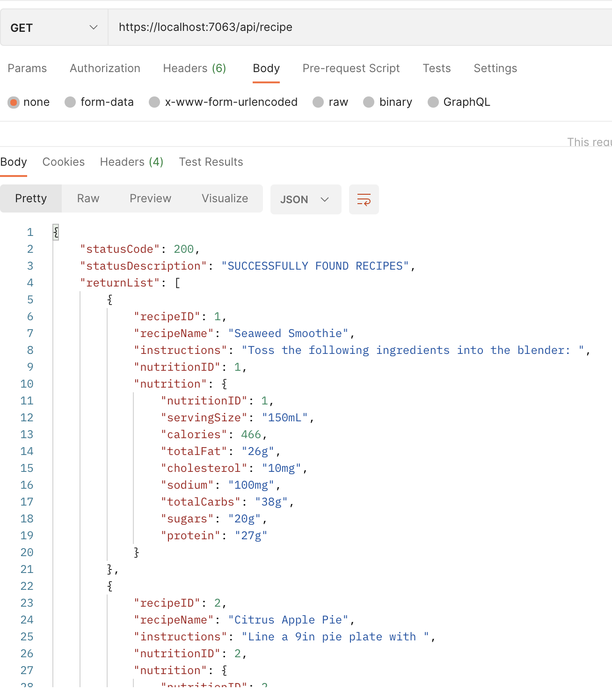
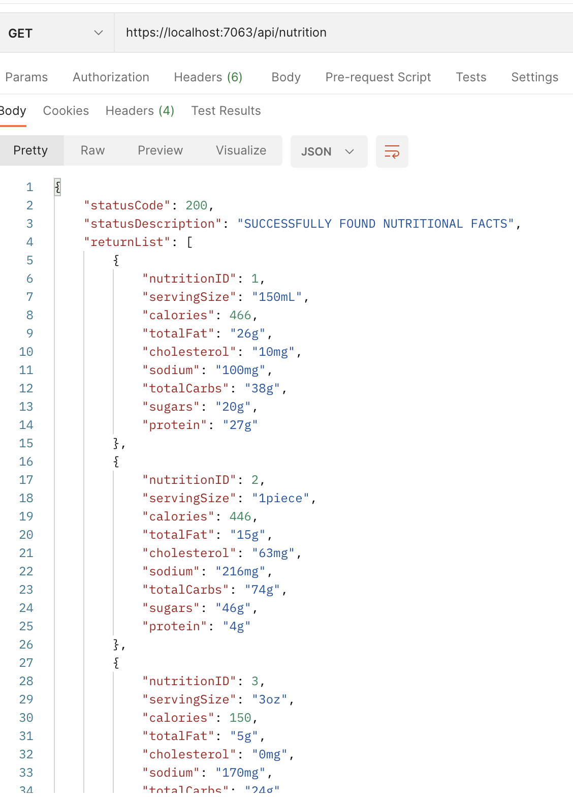 </span>

### GET Endpoints to find an object with matching id:
<span>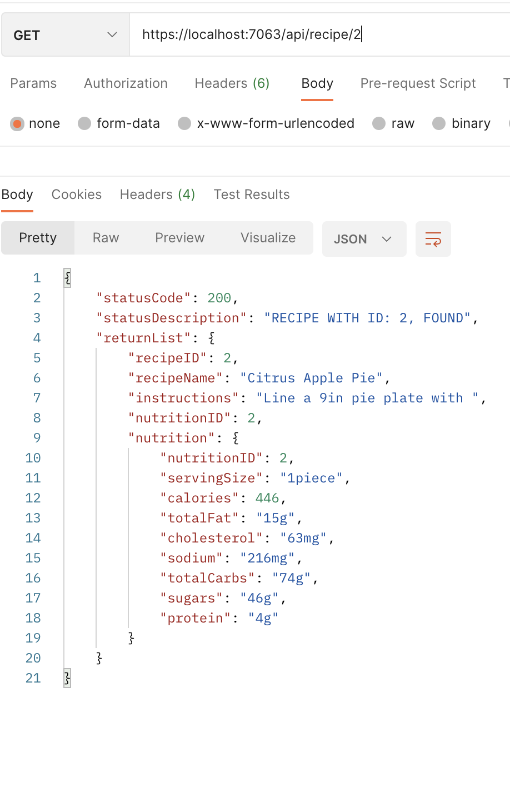
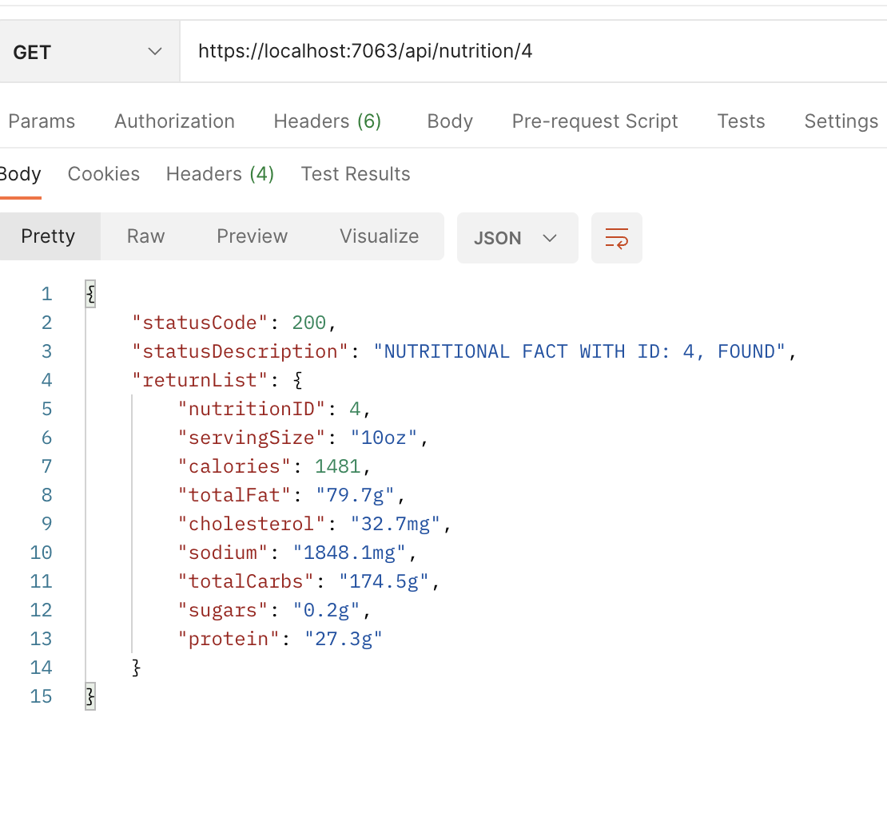 </span>

### GET - When the table does not exist:
<span>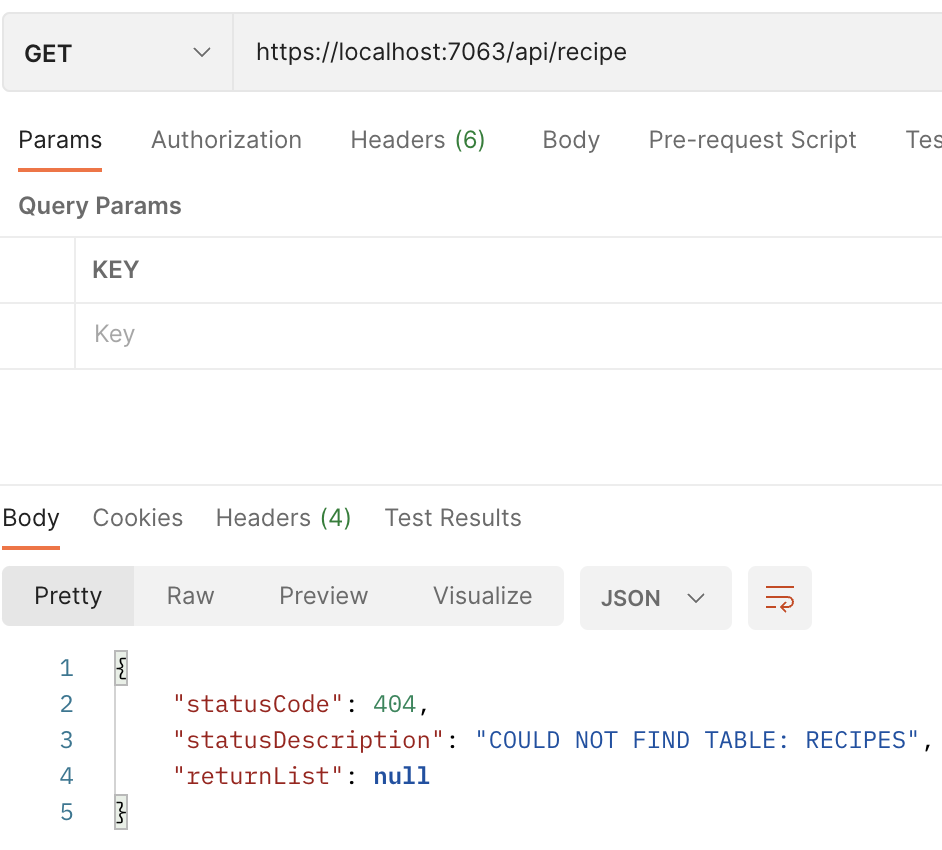
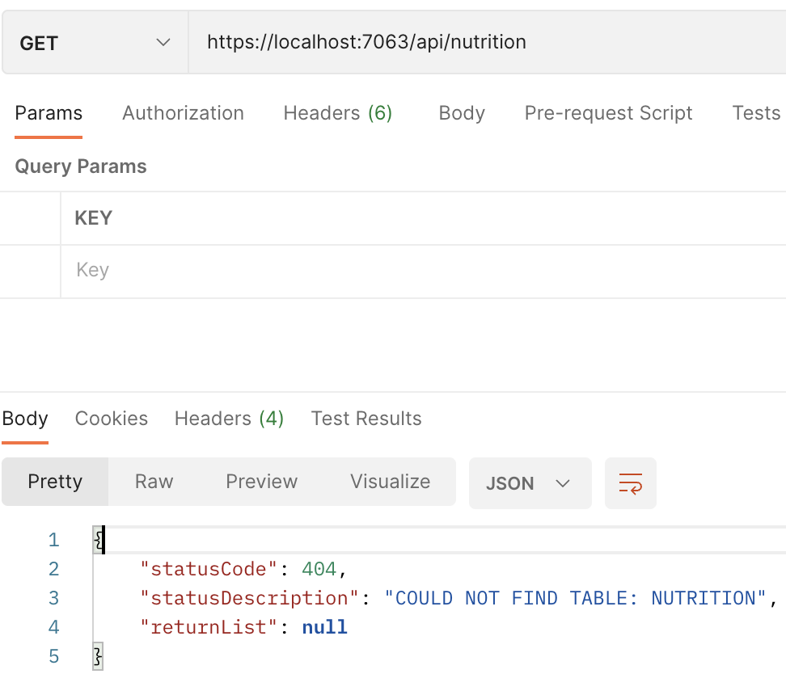 </span>

### GET - When the object with the id does not exist:
<span>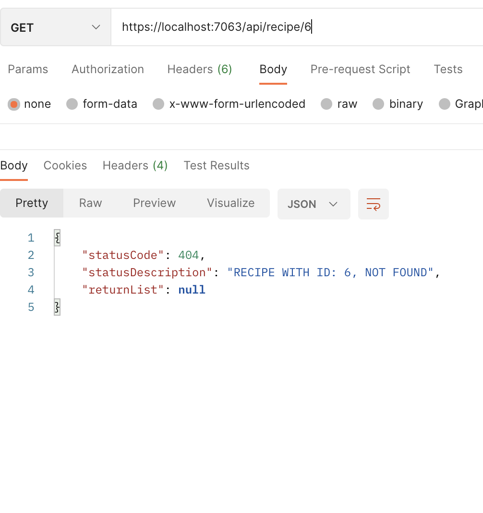
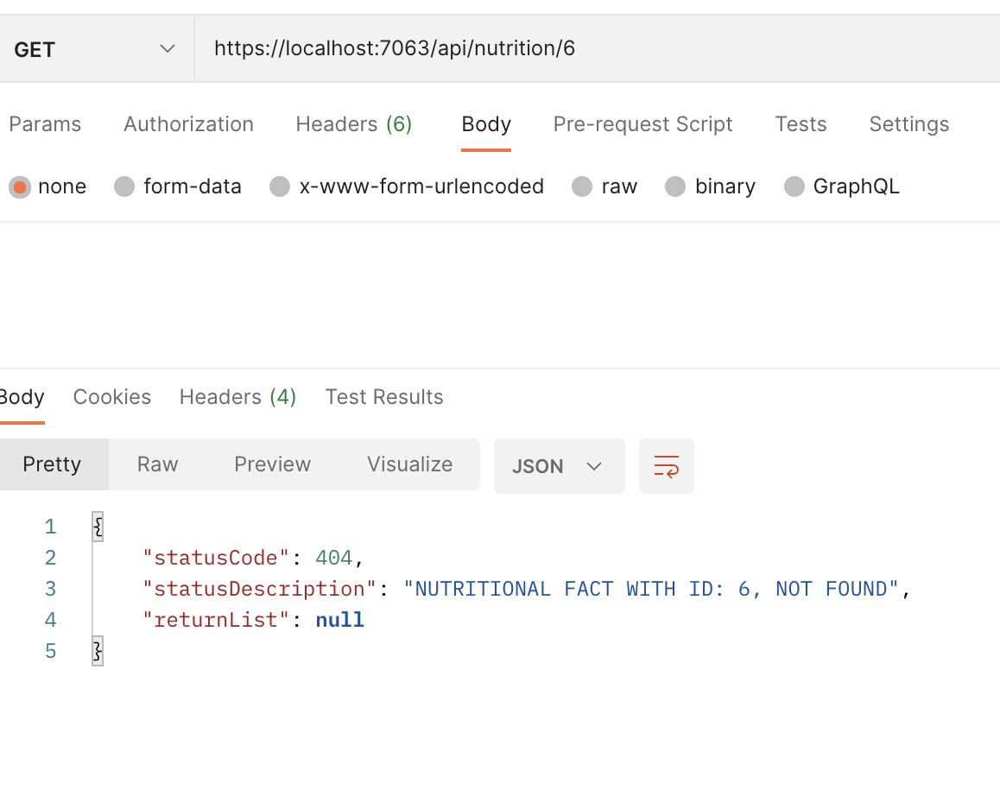 </span>

### POST Endpoint (The POST method for Nutrition has been removed):
RecipeName and Instructions are non-nullable, meaning they must be filled out.
A Nutrition object is required when adding a recipe. However, the fields are nullable, meaning, they can be left blank.

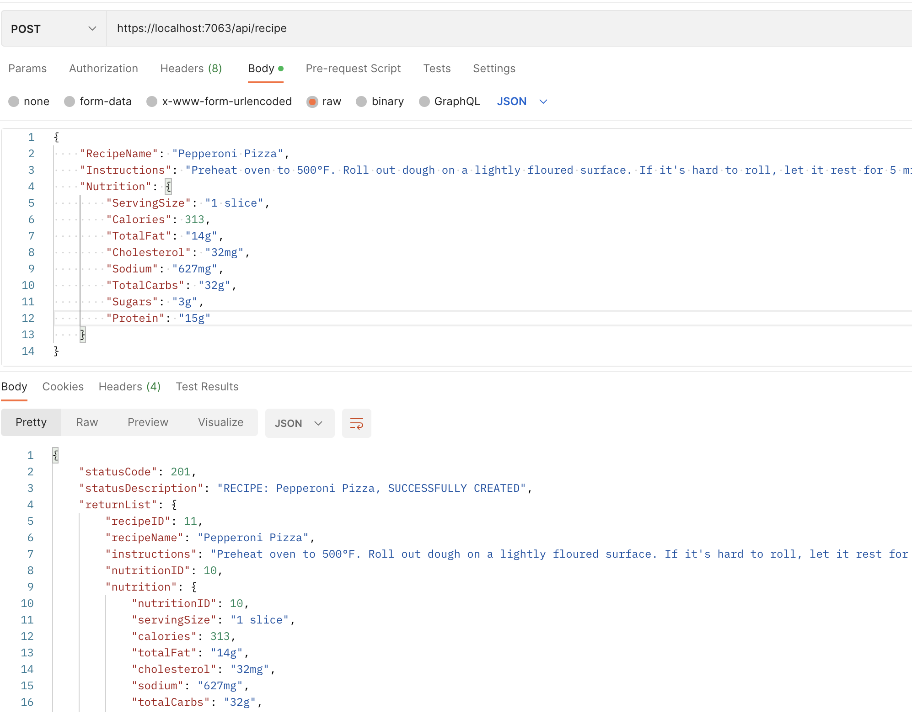

### POST - When the object with the id already exists:
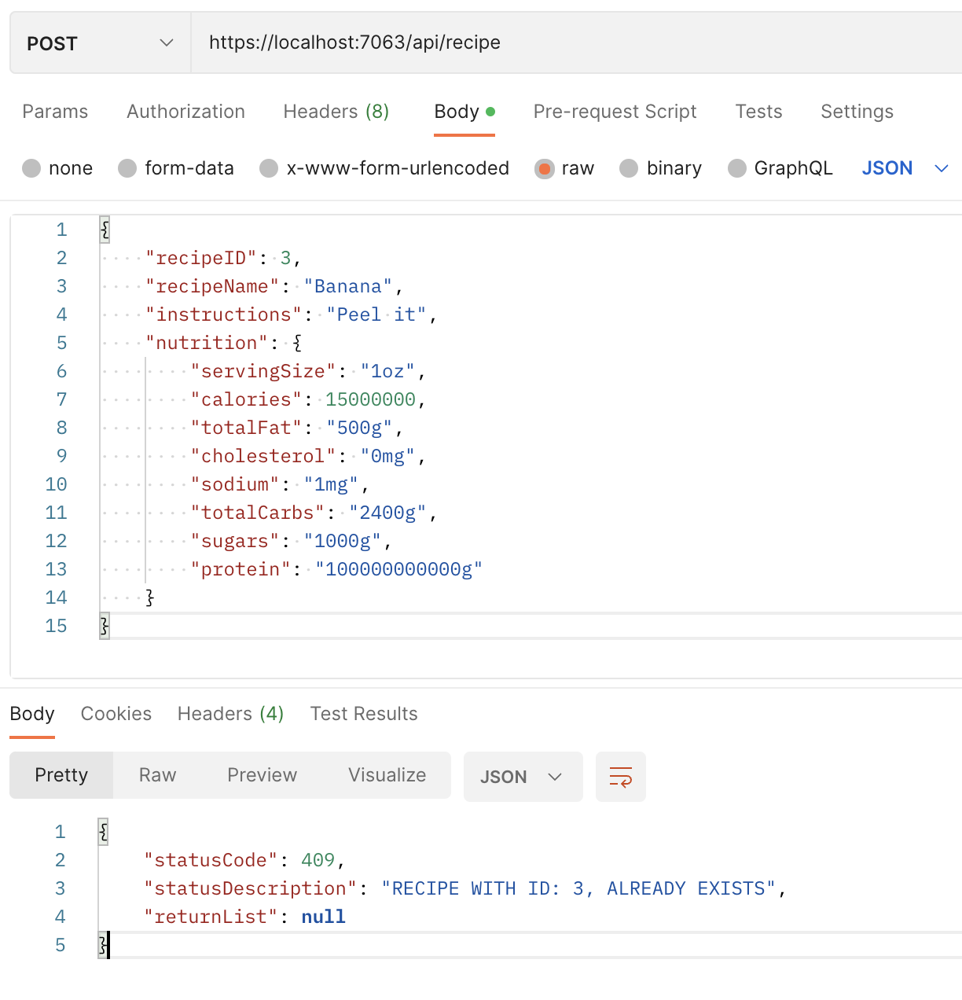

### DELETE Endpoint:
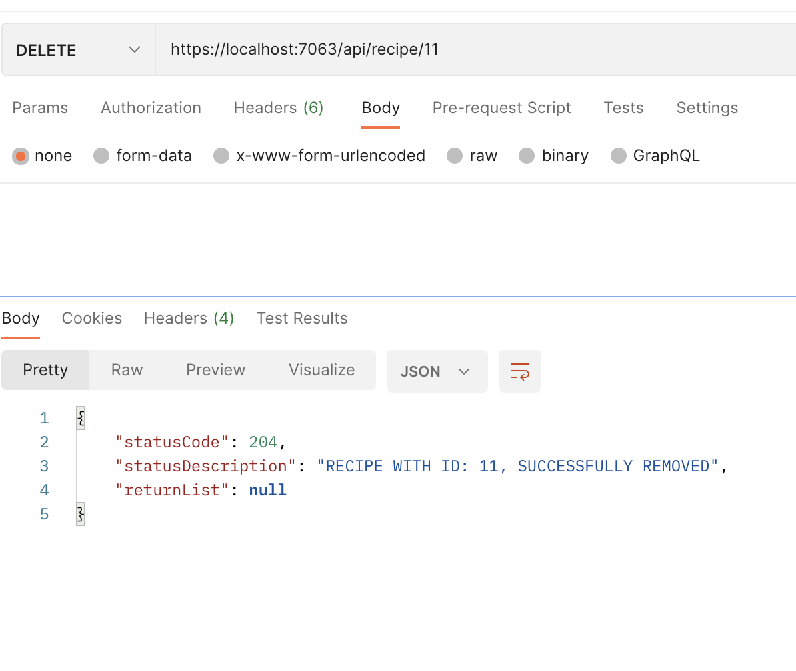

### DELETE - When the object with the id does not exist:
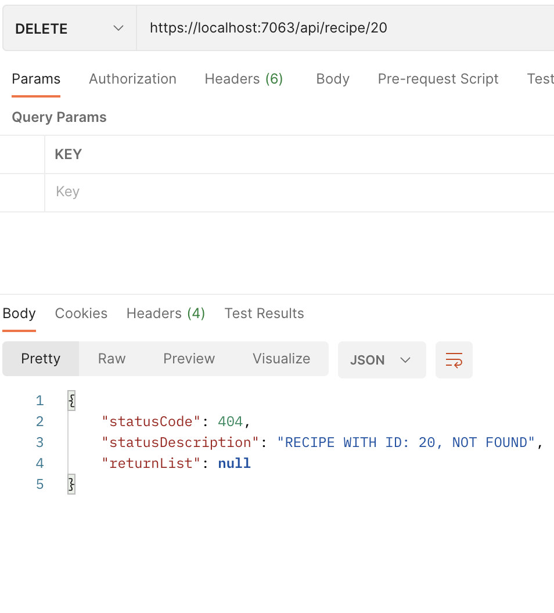

## Changes
Originally it was a one directional one to many relationship between a Recipes table and a Contributors table, where every recipe had one contributor but every contributor could be associated with many recipes. The Recipe table had a foreign key that would point to the primary key of the Contributor table, the ContributorID. Despite adding a custom modelbuilder in the context and adding a list of Recipe objects in the Contributor model and much more debugging, this system was determined to be overly complicated. Therefore, a decision was made to change the goal of the API to a more informational one rather than a social one. This means, rather than taking into account who contributed which recipes, it listed more useful information such as the nutritional facts of each recipe.

## License

[MIT](https://choosealicense.com/licenses/mit/)
